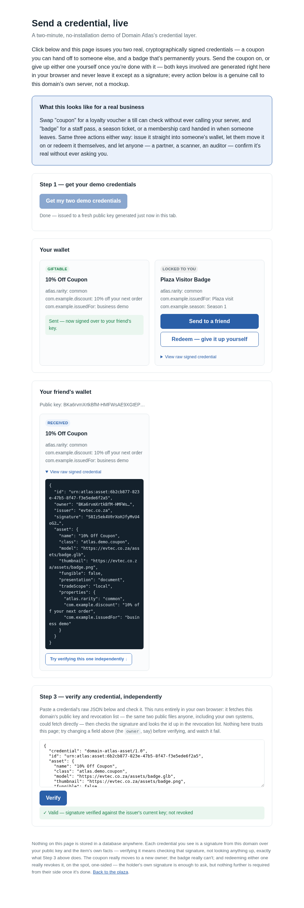

# Domain Atlas

An open protocol for issuing, verifying, and revoking cryptographically
signed credentials — memberships, tickets, staff badges, loyalty
vouchers — without a central database of who holds what. A business
signs a credential straight into someone's wallet; verifying it later
means checking a signature, not looking anything up, and revoking it is
one-sided and instant, nothing required from the holder's side.

**[Try the credential demo live →](https://evtec.co.za/business-demo.html)**
No install needed — issues you a real, giftable credential on the spot,
signed by this exact server. Try sending it to someone else while a
non-transferable one refuses to move; redeem either one yourself and
watch it fail an independent verification you run entirely in your own
browser, against the same public files any outside system could check.



*(`node tools/generate-business-demo-screenshot.js` regenerates the image
above against an isolated instance, for whenever the demo page's look or
flow changes enough to make it stale.)*

The rest of this repository is the full prototype behind that one
endpoint: a browser extension wallet, a spatial 3D client that renders
issued items as visible objects in a virtual world (one illustrative
client the protocol happens to have, not a requirement of it), and the
reference issuer server/PHP port powering both. What follows is a
working proof that the mechanisms in `SPEC.md` are real. A browser
extension reads a domain's manifest, renders whichever worlds it declares,
and lets you walk through three genuinely different kinds of portal — one
that swaps worlds inside a single domain with no network round-trip, one
that crosses to a completely separate domain, and one that leads to a
**key-anchored world** (§3.6) — a space trusted by its own signature
instead of a domain, TLS, or DNS at all — gated behind a mandatory,
non-dismissible trust disclosure before you're let in (§3.6.1). On top of
that, a real wallet: a genuine WebAuthn (or password-backed) identity, real
ECDSA-signed credentials issued by an actual small server, verified with real
cryptography — unique items and fungible resources under one credential
shape, PvP loadouts with an owner-signed transfer-on-loss, open trade
listings a station settles atomically (unique items included, not just
fungible balances), drops anyone present in a world can pick up, and
cross-domain mail through a federated Post Office. A few things ride on
that same identity and credential machinery rather than being bolted on
separately — an in-world chess minigame with a real mint on checkmate, a
Messaging window with genuinely end-to-end-encrypted chat, and a calendar
a domain (or one of its worlds) can publish and any visitor's wallet can
read, even across domains.

```
domain-atlas/
├── SPEC.md                      the protocol spec
├── extension/                    the Chrome extension (unpacked)
│   ├── content.js                 detects the manifest, injects the entry button
│   ├── viewer.html / viewer.js    renders worlds, hosts the wallet panel
│   └── wallet.js                  identity + credential verification (§5, §6)
├── issuer-server/                a real credential issuer for demo-domain-a
│                                    (also plays the "trading station" role — see §4 below)
├── issuer-php/                    plain-PHP port of the issuer, for shared cPanel hosting
├── directory-server/              crawler/index/search over other domains' manifests (§3.3)
├── presence-server/                hand-rolled WebSocket server for multiplayer presence + chat
├── presence-php/                  plain-PHP polling port of presence + chat, same hosting reason
├── demo-domain-a/                 "Example Plaza" — FIVE worlds: plaza, museum, arena, market, lobby
│   └── keyworld/                    a SIXTH, separately-signed key-anchored manifest (§3.6) —
│                                      not one of the five above, reachable only via Plaza's own
│                                      amber portal, deliberately absent from any directory
├── demo-domain-b/                 "Neighbor Workshop" — one world, a real issuer (see below)
├── tools/                         scene-editor.html — a standalone editor for gltf-mini scenes
└── test/
    ├── verify.js                  proves the manifest/portal mechanism
    ├── verify-wallet.js           proves the item wallet end to end
    └── verify-loadout-trading.js  proves loadouts/transfer-on-loss and resources/trading
```

Two local servers stand in for two independent domains — same mechanism as
two real domains, just without needing to own and deploy to actual DNS
names to try it. Both run a real issuer (Domain B needs one too, for its
own Post Office — see below); the point either way is that Domain B needs
zero special integration with Domain A to trust what Domain A hands out.

Every specific name above — `demo-domain-a`/`demo-domain-b`, "Example
Plaza", "Neighbor Workshop", `atlas.wearable.ring`, "Bronze Compass" — is
this demo's own invention, not something `SPEC.md` requires. A real
deployment picks its own domain, its own world names, and its own asset
classes; the protocol doesn't care what any of them are called (see
`SPEC.md`'s own "A note on names").

## 1. Serve the two demo domains

Domain A needs the real issuer server (Node, zero npm dependencies — there
is nothing to `npm install`):

```bash
node issuer-server/server.js
```

The first run generates a real ECDSA P-256 keypair, writes the public half
to `demo-domain-a/.well-known/atlas-key.json`, and keeps the private half
in `issuer-server/issuer-private-key.jwk.json` (git-ignored — never commit
this file). Every run after that reuses the same key.

**Domain B is now a real issuer too**, not a plain static server — task
#75/#87's Post Office needs it to actually mint credentials and sign mail.
It's the exact same `issuer-server/server.js` file, just pointed at a
different docroot/domain/port/state folder via environment variables (see
that file's own comment on `ATLAS_STATE_DIR` for why a second instance
needs its *own* state folder rather than sharing domain A's):

```bash
PORT=8002 ATLAS_DOMAIN=localhost:8002 ATLAS_DOCROOT=demo-domain-b ATLAS_STATE_DIR=issuer-server/domain-b-state node issuer-server/server.js
```

Confirm both are up:

```bash
curl http://localhost:8001/.well-known/spatial.json      # five worlds: plaza, museum, arena, market, lobby
curl http://localhost:8001/.well-known/atlas-key.json    # domain A's real public key
curl http://localhost:8002/.well-known/spatial.json      # one world: workshop
curl http://localhost:8002/.well-known/atlas-key.json    # domain B's real public key — a SEPARATE keypair from domain A's
```

## 2. Load the extension

1. Open `chrome://extensions`.
2. Turn on **Developer mode** (top right).
3. Click **Load unpacked** and select the `extension/` folder.

## 3. Try it — manifest, portals, and the item wallet

1. Visit `http://localhost:8001` — it looks like an ordinary page.
2. A **🧭 Enter Space: Example Plaza (+4 more)** button appears bottom-right.
3. Click it. The Plaza world renders with six portals: four **orange**
   (same-origin, swap worlds, no re-fetch — to the museum, the arena, the
   trading post, and the lobby), one **teal** (crosses to another domain,
   fetches a fresh manifest), and one **amber**, leading to a
   **key-anchored world** (§3.6) — trusted only by its own signature, no
   domain at all. Hover it first: the tooltip already discloses there's no
   domain behind it. Click it and a real, non-dismissible warning screen
   opens before you're let in, explaining exactly what that means and what
   it doesn't protect against; "Enter anyway" drops you into the Unlisted
   Atrium, marked the whole time you're there with an amber badge instead
   of a domain name. Its own portal back to Plaza is an ordinary teal
   cross-domain one — leaving needs no special mechanism of its own.
4. Click **Create Atlas Identity** — a real `navigator.credentials.create()`
   call, your device's own passkey prompt, a genuine keypair. It's now
   persisted, not thrown away when you close the panel.
5. Open the **🎒 Wallet** panel and click **Request item from this world**.
   The extension POSTs to the issuer server, gets back a real signed
   `domain-atlas-asset/1.0` credential, and verifies it itself — fetching
   `atlas-key.json`, checking the signature with the browser's own Web
   Crypto, checking the revocation list — before showing it with a ✓.
6. Click **Present identity** — a fresh WebAuthn assertion, verified
   client-side against the stored public key. Real proof of key
   possession, no server round trip needed to check it.
7. Cross the teal portal to Neighbor Workshop, then click **Re-verify
   wallet against current issuers**. The Bronze Compass still shows ✓ —
   verified from a domain that has never spoken to Example Plaza's issuer,
   using nothing but that issuer's publicly fetched key.
8. Click **Export wallet** for a real `atlas-wallet-export/1.0` JSON file.

To see revocation actually work: `/atlas/revoke` now requires a signed
admin proof envelope rather than a bare id (see "Admin-gated endpoints"
below), so a plain `curl -d '{"id":...}'` no longer does it — run
`node tools/admin-revoke.js <the credential id from the export>` instead,
which registers a local admin identity on first use and signs the call
for you. Then click **Re-verify wallet** again — the item flips to ✗,
reason "revoked by issuer."

**Password identity — a real alternative to the passkey above.** Step 4's
`Create Atlas Identity` isn't the only way to get a "self." At onboarding
(or later, from Settings → Identity method → **Set up a password
identity**), you can instead pick a password (8+ characters); the wallet
generates the exact same kind of ECDSA P-256 keypair, but encrypts the
private half at rest with a key derived from that password (PBKDF2,
600,000 iterations — raised from an original 250,000 by task #118, since
that's a reasonable minimum for PBKDF2-HMAC-SHA256 today) instead of
storing it in hardware. A password identity created before #118 keeps
decrypting fine at its original 250,000 count and silently re-encrypts
itself at 600,000 the next time it's correctly unlocked — no re-prompt,
no separate migration step, and never treated as a wrong password just
for predating the change. It's real and independent — not a fallback
demo mode — you can set up both mechanisms on
one device and switch which one is "you" from Settings any time, instantly
and non-destructively (nothing is deleted; switching back restores exactly
where that identity's wallet was left). It's deliberately the *weaker*
option, though: the decrypted key sits in memory while unlocked, and the
whole thing is only as strong as your password against someone who gets a
copy of the encrypted file — the wallet says as much on the setup screen.
A 🔒 **Quick lock** button in the top control bar locks it without opening
the wallet panel first.

Creating a password identity shows you a **16-word seed phrase once** —
write it down, it's never stored anywhere and never shown again. It isn't
needed for everyday unlocking (password alone does that); it's needed
alongside your password for **Export identity file** (Settings → Identity
method), which wraps your real private key for safekeeping or moving to
another device. **Import an identity file instead** appears right on the
onboarding screen for bringing that backup onto a new install — feed it
back the same password and seed phrase and it decrypts, then re-encrypts
locally under your password for everyday use. Get either the password or
the seed phrase wrong and you get one identical "incorrect" error either
way, deliberately — the wallet won't tell an attacker which of the two
secrets they've got right.

**Wallet items, beyond the basics.** A few more actions live in the
Wallet/Settings panels once you've got items to work with:

- **Hide an item** (available from any item card) tucks it out of the main
  Inventory list without deleting it — it still exports, still
  re-verifies, and is always reachable again from **Settings → Hidden
  assets → Unhide**. Unlike Delete, hiding can never lose an asset that
  exists nowhere else.
- **Drop and pick up items in-world (SPEC.md §5.5).** Click **Drop** on a
  carried item to place it at a clicked ground point (2D worlds) or your
  current position (gltf-mini's 3D ones); a fungible balance's card offers
  a quantity box first, so you can drop part of a stack instead of all of
  it (the rest splits off and stays in your wallet). Unlike the drop
  mechanism this replaced, this is a real, shared transfer: the item
  genuinely leaves your wallet the moment it lands, anyone currently
  standing in that world can see it (a live scene marker, or the "Dropped
  in this world" list — no need to leave and come back) and pick it up with
  a fresh, freshly-minted credential of their own, including you if nobody
  else gets there first. Works even when the item was issued by a
  different domain than the one hosting the world — claiming it quietly
  relays to the actual issuer behind the scenes. A domain/Post Office/
  Trading Station membership card can never be dropped (`tradeScope:
  "bound"`, enforced by the server, not just the UI).
- **Nicknames for other identities.** From a presence roster or a mail
  card, set a private alias for any public key you interact with — purely
  local, never sent anywhere, and profanity-filtered the same way
  `handle#domain` registration is (§8 below).
- **Search filters** on the Collectibles and Documents lists (type to
  filter live) once a wallet has more than a handful of items.
- **Character scale** — a 0.5×–2× avatar-size slider in Settings, purely
  cosmetic (doesn't touch movement speed, collision, or camera distance).
- **Asset cache management** (Settings → Cache) — browse what's cached
  per-site from `gltf-mini`'s local GLB cache (§8's `verify-asset-cache.js`
  proves the caching mechanism itself), clear one site or everything, or
  export/import the whole cache as a portable JSON file.
- **Fullscreen cursor auto-hide.** F11's native browser fullscreen gives no
  direct "am I fullscreen" event to listen for, so the extension infers it
  (viewport exactly matches the physical screen) and hides the cursor after
  ~2s idle while in that state, reappearing instantly on movement, resize,
  or leaving fullscreen — a small polish detail, not a behavior you need to
  configure.

## 4. Try it — loadouts, transfer-on-loss, resources, and trading

These all live in the same wallet panel, and use one addition worth being
upfront about: a second **counterparty** identity, needed for the
transfer-on-loss demo below since that needs two independent signers and
this demo runs in one browser tab. Rather than fake that, the "self"
identity is a real WebAuthn passkey throughout, exactly as in section 3,
and the "counterparty" is a second, purely local ECDSA P-256 keypair — no
WebAuthn, generated and stored the same way a lightweight non-passkey
client would. It signs for real; it just isn't a hardware-backed key. Click
**Create counterparty identity** in the wallet panel to generate it. Trading
below doesn't use it at all — see that section.

**Loadouts and transfer-on-loss (§5.2):**

1. With an item in your self wallet, walk to the **arena** portal
   (orange). The panel shows a PvP warning — this world's manifest
   declares `profile.capabilities.combat: "pvp"`.
2. Click **Load** on an item card to bring it into this world's loadout.
   A loaded item in a PvP world gets a **Simulate PvP loss** button.
3. Click it. This is the interesting part: the *loser's own key* signs the
   transfer. `wallet.js` builds a `domain-atlas-transfer/1.0` payload
   (`itemId`, `from`, `to`, `worldContext`, timestamp), hashes it, and runs
   it through a real WebAuthn assertion — the same `challenge`-hash trick
   used everywhere else, since a passkey can't sign arbitrary application
   data directly, only the fixed assertion structure. The wallet verifies
   its own signature before applying the move (if that check ever failed,
   it would refuse). The item disappears from the self wallet and appears,
   correctly signed, in the counterparty's — a real ownership change, not
   the server unilaterally reassigning it.

**Fungible resources (§5.4):**

4. Walk back to Plaza, then through the **market** portal into the Trading
   Post. Click **Mine 20 iron**, **Mine 10 gold**, and **Mine 15 silver** —
   all three mint to your own self identity; each mint POSTs to the issuer,
   gets back a real signed `domain-atlas-resource/1.0` balance credential,
   and verifies it the same way items are verified.
5. Click **Send half** on a resource card to split a balance: the issuer
   validates the presented credential, then issues two new balances (a
   remainder back to the sender, the sent amount to the recipient) both
   pointing at the original via `supersedes`, and revokes the original as
   `"superseded"`. Nothing is ever mutated in place — every balance change
   is a fresh signed credential plus a revocation of the old one.

**Trading stations (§7):**

6. Open the wallet's **Trade** tab. Click **Join** to get this domain's
   Trading Station membership, then, on **Sell**, pick what you hold and
   what you want (say, 10 iron for 5 gold) and click **Post listing** — a
   signed intent naming no counterparty at all, queued at the station as an
   open listing. On **Buy**, click **Refresh** to browse every open,
   unexpired listing any member has posted, and **Trade** on one to claim
   it: the station checks your own mirroring intent and presented balance,
   confirms the listing is still open, and atomically issues both sides'
   new credentials while revoking both pre-trade balances — the same
   all-or-nothing settlement any two-party trade needs, just triggered by a
   claim instead of two visitors standing at the same stall at once. A
   unique item works the same way, not just a fungible balance like iron or
   gold — post a listing naming a specific held item (the Signet Ring, say)
   as your `offer` or `want`, and a claim transfers that exact instance,
   serial number and any rolled properties intact, rather than minting a
   fresh substitute. A listing you haven't claimed can be withdrawn from
   the **Listings** tab
   with **Cancel**; a settled, canceled, or expired one can be cleared from
   that same tab with **Delete**.

## 5. Try the directory service

A reference implementation of SPEC.md §3.3 — a crawler/index/search
service, separate from either issuer on purpose (a directory indexes OTHER
domains; it doesn't issue credentials for its own). Zero dependencies,
same as the issuer:

```bash
node directory-server/server.js
```

With both demo domains already running, submit them and search:

```bash
curl -X POST http://localhost:8003/submit -H "Content-Type: application/json" \
  -d '{"manifest":"http://localhost:8001/.well-known/spatial.json"}'
curl -X POST http://localhost:8003/submit -H "Content-Type: application/json" \
  -d '{"manifest":"http://localhost:8002/.well-known/spatial.json"}'

curl "http://localhost:8003/search?scale=district"
curl "http://localhost:8003/search?q=workshop"
```

Or open `http://localhost:8003` for a small search UI. Results are ranked
by inbound `"kind": "domain"` portal count — the same insight PageRank
started from, applied to this much smaller graph — and domain-anchored vs.
key-anchored listings are always labeled, never presented as equivalent
(§3.6.1). A background scheduler re-crawls every submitted manifest on an
interval (60s by default; override with `DIRECTORY_CRAWL_INTERVAL_MS`), so
a world that changes its name, genre, or `discoverable` flag is picked up
on its next scheduled pass, not instantly — the same eventual consistency
a real search index has with the live web.

## 6. Try multiplayer presence

Other visitors in the same world, visible and moving in real time — a
separate service on purpose (same reasoning as the directory server: this
isn't the issuer's job), zero dependencies, hand-rolled WebSocket framing
(RFC 6455) over Node's own `http`/`crypto` rather than pulling in `ws`:

```bash
node presence-server/server.js
```

It listens on `http://localhost:8004`, upgrading `/presence` connections
to WebSocket. Rooms are keyed by `domain::world`, so visitors only ever see
others in the exact same world. Walk into the Lobby (the one
`gltf-mini-v1` world) from two separate browser profiles at once and each
sees the other's character walking around, positions smoothed between the
network updates rather than snapping.

This is presence, not a production multiplayer backend — there's no
server-side movement authority, anti-cheat, or persistence; a client
reports its own position and the server just relays it to the room. It's
also entirely optional at runtime: if `presence-server` isn't running, or
becomes unreachable mid-session, the extension fails the connection
silently and world entry and single-player movement are completely
unaffected — you just won't see anyone else.

**Polling fallback (no WebSocket needed).** WebSocket needs a persistent
process bound to a port, which plain cPanel/Apache+PHP shared hosting
can't run at all — the same constraint that made the issuer need a PHP
port (see `issuer-php/README.txt`). So `presence-server` also answers a
plain HTTP polling API (`POST /presence/poll/join`, `/sync`, `/leave`)
backed by the exact same rooms as the WebSocket side — a WS visitor and a
polling visitor in the same world see each other correctly either way. The
extension tries WebSocket first and only falls back to polling if that
fails or hangs, entirely on its own; nothing to configure beyond a
manifest field (see below). To see the fallback path itself in action
against the Node server rather than trust it's there, run it with
`PRESENCE_DISABLE_WS=1` (rejects every WebSocket upgrade, simulating a
polling-only host) — multiplayer still works, just on a ~2s update cycle
instead of continuous.

Which endpoint the extension talks to is manifest-declared, not hardcoded:
a domain adds an optional top-level `"presence"` field to its
`.well-known/spatial.json` (e.g. `"presence": "https://example.com"`) and
`extension/viewer.js` derives both the WebSocket URL and the polling base
from it. No manifest field at all (every local demo domain in this repo)
falls back to the Node dev default, `localhost:8004`.

That per-domain field is what makes `presence-php/` real rather than
theoretical: a plain-PHP port of ONLY the polling routes (no WebSocket —
see `presence-php/README.txt` for exactly why that half can't be ported to
shared hosting in any language), deployable to a real domain's actual cPanel
hosting the same way `issuer-php/` already is. Point a domain's `presence`
field at a host running just this PHP bundle and the extension's own
WS-then-poll fallback logic does the rest — there's no separate
"polling-only" flag to set anywhere.

**Duplicate-identity join guard and self-eviction fix (tasks #137, #139).**
Two visitors sharing the same key pair — the counterparty identity from
section 4, or the same wallet open in two tabs — used to both end up in
the roster under conflicting entries. Joining now checks for an existing,
still-active member with the same public key first: if one's found, the
newcomer gets a short **challenge countdown** instead of an instant join,
giving the original tab a chance to prove it's still there before either
side is admitted, mirrored identically across the WebSocket server, the
polling routes, and `presence-php`. A related bug (#139) meant a
backgrounded or throttled browser tab could get silently swept from the
roster by its own poll timer and then auto-rejoin mid-challenge, fighting
whoever actually won it; polling clients now distinguish plain staleness
(safe to silently self-heal from) from a lost duplicate-identity challenge
(left alone on purpose) and also resync immediately on tab refocus rather
than waiting out the next poll tick.

## 7. Try in-world chat

A standalone `#chatWidget` overlay, bottom-left of the 3D canvas — separate
from the Wallet/Social/Settings tab bar entirely, so it stays up and usable
while you've got the wallet panel open on top of it. It's read-only for
everyone by default and only ever sendable while you're actually standing
in a world that's opted in.

**Which tabs show up is manifest-declared, not hardcoded.** A domain adds
chat the same optional way it adds presence and Post Office: a top-level
`manifest.chat: true` opts the whole domain in and adds a leftmost
**Domain** tab (everyone in any of that domain's worlds shares it), and
each individual world can separately set its own `world.chat: true` to get
its own tab too. Example Plaza has both, so Domain A shows three tabs —
**Domain**, **Example Plaza**, **Example Arena** — while Neighbor Workshop
(Domain B) only sets the domain-wide flag and so shows just the one
**Domain** tab. Whichever tab matches where you're physically standing
right now carries a live **"(current)"** suffix that moves the moment you
walk through a portal — Market and Museum have no chat flag of their own,
so standing there still shows the full tab set (tabs are declared once per
manifest, not scoped to your current world) but with no dedicated tab to
put a suffix on. Sending is disabled — input greyed out, with a
placeholder explaining why — while you're viewing a tab for somewhere
you're not currently standing (someone else's world tab, or Domain from a
one-tab-only world), and re-enables the instant you switch to a sendable
tab, no need to leave and re-enter. Which tab opens by default on a fresh
world entry is controlled by **Settings → Chat → default tab**: `auto`
(the default — currently behaves like `world`), `domain`, or `world`, and
it genuinely drives the choice, not just availability, when both a
Domain tab and a world tab are on offer.

**History on join** is on by default — joining a chat-enabled world hands
you a batch of recent messages so a conversation already in progress isn't
a blank screen. Turn it off from the chat settings popover (⚙) and a fresh
join instead starts empty, even though the server's own history buffer
still has everything; live messages sent after you join show up either
way; the toggle only ever affects that one join-time batch.

**Usernames are interactive.** Hovering any sender's name shows a
tooltip with a human-readable timestamp and online status; right-clicking
one opens a small context menu — **Private message**, **Mute user**,
**Block user** — the same visual language as Mail's block-sender menu.
Muting or blocking is purely local and per-viewer (the muted/blocked
person's own view is unaffected): their messages simply stop rendering for
you, and both lists are reviewable and reversible from **Settings → Chat
Admin → Muted users / Blocked users** (Unmute/Unblock). **Private message**
jumps straight to Mail → Compose with the recipient field pre-filled with
that sender's raw public key — chat has no handle system of its own, so
this is the fastest way to actually reach someone you only know from a
chat message.

Chat rides the exact same dual-transport design presence does: the
WebSocket side lives in `presence-server/server.js` alongside presence
itself (`chat-join`/`chat-message`/etc. over the same socket), and
`presence-php` mirrors just the polling half (`/presence/poll/chat-join`,
`chat-sync`, `chat-send`, `chat-leave`) for shared cPanel-style hosting
that can't run a persistent WebSocket process — no separate service to run
or manifest field to add beyond the `chat`/`presence` flags already
described above.

## 8. Friends, Favorites, and the Social tab

The wallet's top tab bar is now Wallet / Social / Settings — the old
standalone Mail tab moved inside Social, alongside three newer sections:
**Contacts** (#67, despite the name a friends list, not an address book —
see below), **Favorites** (#61), and **Calendar**. Open the Social tab and
its own sub-tab-bar switches between all four.

**Domain-to-subscriber mail (SPEC.md §11.1) — the original Mail tab.** A
domain can message anyone holding one of its own credentials, addressed by
`credentialId` rather than by public key. **Subscribe to `<domain>`**
(shown while standing in a world you haven't already subscribed to) mints
an `atlas.membership` credential the same way requesting any other item
does — that credential is what a domain mails against. On the issuer side,
`/atlas/mail/send` (the demo/admin surface standing in for whatever a real
domain's own backend would do, now admin-gated — see "Admin-gated
endpoints" below) sends against a `credentialId`; the wallet picks new
mail up through its existing periodic `/atlas/mail/check` loop alongside
asset-reissue notices (§5.1.1 above).

A mail message can carry a **gift** — a fresh credential attached at send
time, addressed to a specific visitor. A gift never joins the wallet
automatically the way a reissue replacement does: the mail card shows a
**Claim** button, and only clicking it verifies the attached credential and
adds it — receiving property from someone, even a domain, is deliberately
never a silent step (SPEC.md §11.2).

**Friends work live, through presence — not through mail.** Adding a
friend needs both people simultaneously in the same `domain::world` room:
open the Contacts tab's Add Contact sub-tab while standing in a world with
someone else in it, and "People here now" lists them with an Add friend button (only if
they've got an unlocked wallet identity announced — an anonymous visitor
can't be friended, same "presence never requires an identity" principle
world entry itself has always had). Clicking it sends a `friend-request`
signal over whichever presence transport is actually connected right now
(WebSocket or the polling fallback, transparently) to exactly that one
other visitor. On their side it shows up under "Friend requests" with
Accept/Decline; accepting saves the friend on both ends — the accepter
immediately, and the original sender automatically once the
`friend-request-accepted` reply signal reaches them back, no second click
needed. This only works while both of you are still in the room: a
request or its reply can't be relayed to someone who's already left, same
as the roster itself only ever shows who's actually there.

**The Contacts sub-tab has three inner tabs of its own** — Contacts / Add
Contact / Groups. Live presence isn't the only way in: Add Contact also
takes a contact **manually**, either by pasting a raw public key or by
typing a `handle#domain` address (resolved through that domain's Post
Office the same way Compose's recipient field resolves one — see handle
addressing below), with no presence connection to the other person needed
either way. Every saved contact gets a free-text **notes** field (saves on
blur, persists in the wallet) and the Contacts list itself has a **search
box** that filters live by name AND notes as you type. **Groups** is a
separate, purely local, personal-organization layer on top of the same
saved-contacts list — for sorting people into your own categories, nothing
that's ever sent anywhere.

This deliberately does NOT go through the existing mail system. Mail
(`AtlasWallet.checkAllMail`) is domain-issuer-to-subscriber only —
messages are addressed by `credentialId` and fetched per-domain from
credentials the wallet already holds, and there's no way to even discover
a stranger's `credentialId` to mail them (see `issuer-php/README.txt`'s
note on why there's deliberately no public subscriber-listing endpoint).
Friends needed a genuine peer-to-peer channel between two arbitrary
visitors, so it rides a new, narrow **signal relay** built into presence
itself instead: `presence-server/server.js`'s `relaySignal()` (WS message
type `'signal'` / `POST /presence/poll/signal`) and `presence-php`'s
`poll/signal.php` twin. The vocabulary is closed to exactly three kinds —
`friend-request`, `friend-request-accepted`, `friend-request-declined` —
the server relays them (pushed immediately to a WebSocket member, queued
into `pendingSignals` and picked up on the next poll `sync` for a polling
one) without ever inspecting or storing anything beyond that.

**Favorites bookmark a domain+world**, independent of the auto-pruned
Recent Worlds list on the main Wallet screen (Favorites are explicit
add/remove only, and you control their order). "Favorite this domain"
appears while you're actually standing in a world; the Favorites list
itself shows every bookmark with a live "N here now" status line, pulled
fresh from that domain's own presence backend every time the list renders
(`GET /presence/status?domain=...&world=...` — reports who's in a room
without creating a member the way joining would). If any of your saved
friends are in that count, they're named right there too — "3 here now ·
friends here: Nomad". That cross-referencing happens **entirely on your
own device**: the status endpoint only ever returns who's actually
present (id, name, publicKey), and your friends list is matched against
it locally. No server, including presence-server itself, ever sees your
friends list.

**Calendar is local-only** — manually-added personal reminders, nothing
synced from anywhere and nothing any domain can see or write to (unlike
Mail, no domain or other visitor can ever add an event to it). A persistent
phone-widget-style **month grid** sits pinned above the add/edit form and
event list; clicking a day opens a **day viewer** showing that day's events
by hour, with an "other month" section when the clicked day falls outside
the currently-viewed month. Each event has a title, a required start time,
an optional end time (an event with a duration gets a distinct visual
treatment in both the list and the day viewer), and free-text notes. An
event that's overdue is flagged distinctly wherever it appears — the list,
the day viewer, and a badge on the Calendar sub-tab itself — and every
mail card carries an **"Add to calendar"** button that pre-fills the
event form from that message's subject and body, a quick bridge from
"someone told me about this" to "it's on my calendar."

**Quick lock.** A 🔒 button now sits in the top control bar next to
Wallet, for locking without opening the wallet panel first — distinct
from the existing Lock button buried in Settings → Identity method, which
is still there for anyone who navigates in that way. It only shows up
while there's actually an unlocked local-password identity to lock.

**Post Office — user-to-user mail (task #75/#87/#94/#95/#96, SPEC.md §11.3).**
Everything above this point in "Mail" is domain-to-subscriber only: a
domain mails someone who holds one of ITS credentials. Post Office is the
other half — two people mailing each other, addressed by public key,
routed through a domain both of them have joined. Membership is symmetric:
holding a Global Mail Membership Card at a domain is what makes that
domain your sending relay AND your inbox there, not just one or the
other — you don't have to be standing in that world to send through it,
only to have joined it at some point, same as receiving. Try it with two
identities:

1. Join Domain B's Post Office for BOTH identities you want to mail
   between (a second browser profile, or Domain A's own counterparty
   key) — since task #95, sending only works between two people who've
   both joined the same Post Office. Two ways to do it: walk into Domain
   B's Neighbor Workshop and click the blue **Post Office** stall
   ("Claim Global Mail Membership", the same one-click "collect" pattern
   the Workbench and market stalls already use), or — since task #94 —
   just open Social → Mail while standing in Domain B and click **Join**
   under the "Post Office" heading, no stall-finding required. That
   button only appears at a domain whose manifest advertises
   `"postOffice": true` (see demo-domain-b/.well-known/spatial.json) —
   the same plain, optional, implementation-only field pattern `presence`
   already uses, not part of SPEC.md.
2. Open Social → Mail on each identity. "Your address" shows a copyable
   public key — hand identity B's to identity A (or vice versa).
3. Under "Send mail," the dropdown lists every Post Office this wallet has
   actually joined — pick `localhost:8002`, paste the recipient's public
   key, write a subject and message, and hit Send.
4. On the recipient's wallet, click "Check now" (or just wait for the next
   periodic check) — the message shows up in Mail like anything else, but
   headed "From `<their key>` via localhost:8002" instead of a bare domain
   name, so it's visually distinct from mail the domain itself sent you.

Both sides need membership because that's what makes "send through this
Post Office" mean something — it isn't an open relay for anyone with a
wallet, only for people the domain has already vouched for by handing them
a card. A sender with no membership at the target domain gets rejected
before the message goes anywhere; a recipient with no membership there
gets a plain rejection back too, not a silently-dropped message.

**Abuse detection (task #96).** Symmetric membership (#95) means every
send is now tied to a specific credential, which is what makes flagging
possible at all — there's someone accountable to flag. Every successful
send is logged against the SENDER's own membership; more than
`ATLAS_POSTOFFICE_SPAM_THRESHOLD` sends (default 5) within
`ATLAS_POSTOFFICE_SPAM_WINDOW_MS` (default 60000, i.e. a minute) auto-sets
`flagged: true` on that member's entry, recomputed live on every send —
a burst that's gone quiet un-flags itself, no manual "clear" step exists
or is needed. Flagging never blocks a send by itself; it only marks the
roster entry for a human to look at. There's deliberately no new public
"list activity" endpoint for this — same "would leak every member's
public key to anyone who asks" reasoning already applied to the
subscriber roster elsewhere in this project — so seeing it means opening
`issuer-server/atlas-postoffice-members-store.json` (or the equivalent
PHP state file) directly, the same way an operator already would to see
who's a member at all. Once you've decided a flagged member deserves it,
cutting them off needs nothing new: call the existing
`POST /atlas/revoke` with that member's `credentialId` (as a registered
domain admin — see "Admin-gated endpoints" below, or just run
`node tools/admin-revoke.js <credentialId> --domain-b`), and thanks to
#95's symmetric check, one call blocks them from both sending AND
receiving through that domain at once. `test/manual-postoffice-abuse.js`
walks the whole flow end to end — burst past the threshold, confirm the
flag, revoke, confirm both directions are now blocked.

**Consent/block model (task #94's remaining piece — "both, recipient's
choice").** Membership (#95) is the baseline gate — both people have to
have joined the same Post Office — but a member can narrow who reaches
them further, on top of that, from the wallet's Social → Mail → "Who can
mail you" panel:
- **Block list.** Name a specific public key and that domain stops
  relaying mail from it to you, full stop — a block always wins over
  everything else below. Also reachable straight from a relayed message
  itself: every mail card from a real sender (not domain-to-subscriber
  mail) carries an inline **Block sender** button next to Delete.
- **Friends only.** Switch a membership to friends-only and the domain
  will only relay mail from public keys in a snapshot you submit — pulled
  from this wallet's own local Friends list (Social → Contacts), which
  otherwise never leaves the wallet at all; turning this on is an explicit,
  one-time disclosure of that snapshot to that one domain. It's a snapshot,
  not a live sync — add someone to Friends later and they're not covered
  until you save the panel again.

Both settings are per membership (a wallet belonging to several Post
Offices sets them separately for each) and self-service — three new
domain endpoints (`POST /atlas/postoffice/mailmode`, `/block`, `/unblock`)
authenticate the caller the same self-signed-envelope way
`/atlas/postoffice/send` already authenticates a sender, so nobody can
touch a membership that isn't their own. A fourth,
`POST /atlas/postoffice/mysettings`, is the one Post Office roster lookup
that IS safe to expose over HTTP despite #96's "no public listing"
reasoning: it's gated by that same envelope, so it only ever hands a
caller back their own entry, which is exactly what the settings panel
reads on open (and after every save) rather than trusting local state.
Rejections from either rule read identically ("recipient is not accepting
mail from you right now") so a sender can't distinguish an outright block
from simply not being on a friends-only list. `test/manual-postoffice-
consent.js` covers the server side end to end (block/unblock, friends-only
admission and exclusion, block-beats-friends-only, mode-switch clearing
the snapshot); `test/manual-postoffice-consent-ui.js` drives the real
wallet panel.

**Handle addressing (task #94's last remaining piece — "hide the raw
public key from users").** A member can register a short handle at ONE
Post Office instead of handing out their raw public key — from the same
"Who can mail you" panel, now headed "Your Post Office settings," under
"Your handle." Deliberately `handle#domain`, **not** `handle@domain` — the
`@` shape reads as a real email address and would mislead people about
what this actually is (no inbox provider, no password recovery, nothing
like SMTP underneath); the `#` separator reads more like a Discord-style
tag, which is closer to what it actually is. Compose's recipient field is
handle-first by default: type a bare handle (the domain comes from the
"Send mail" dropdown already picked above it) or paste a full
`handle#domain` string and it selects the right domain for you; a
**"Paste a raw public key instead"** link swaps in the old raw-key field
for anyone who hasn't registered a handle yet.

A handle is unique per DOMAIN, not globally — the same "one card, one Post
Office" scope every other membership setting already has, matched
case-insensitively (`Bob` and `bob` can't both be registered at the same
domain, and a lookup tolerates whatever casing you type). Two new
endpoints: `POST /atlas/postoffice/handle` (self-signed the same way as
mailmode/block/unblock — claim, change, or clear your own) and
`POST /atlas/postoffice/resolve` (a single lookup, handle in → public key
out, no roster dump, no authentication needed — resolving a handle you
already know doesn't require proving who's asking, any more than already
knowing someone's raw public key would). Format and profanity are both
enforced server-side, independently of whatever the wallet's own
same-shaped check already caught, since a modified client could skip that
one.

The nice part: showing a *recipient's* handle instead of their raw key
needs no reverse-lookup endpoint at all. The relaying domain already
stamps `from: {publicKey}` onto outgoing mail (see #95) — it now also adds
the sender's own registered handle, if they have one, to that same stamp,
since it's already sitting right there in its roster. A mail card headed
"From bruno#localhost:8002" is just that field rendered; a sender with no
handle still falls back to the old raw-key fragment. `test/manual-
postoffice-handle.js` covers the server side end to end (claim/uniqueness/
case-insensitivity/format/profanity/resolve/auto-stamping/clearing, run
clean against both issuers); `test/manual-postoffice-handle-ui.js` drives
the real wallet panel and Compose, including a full round trip by bare
handle, by a pasted `handle#domain` address, and via the raw-key fallback.

With this, task #94 is now fully built — handle addressing was its last
open piece.

## Fixing a stale tradeScope on an already-issued credential

`tradeScope` is baked into a credential's signed payload at mint time
(`mintAssetByClass`'s `catalogEntry.tradeScope || 'local'`, mirrored in
`atlas_asset_catalog_entry()` on the PHP side). That means tightening a
catalog entry to `tradeScope: 'bound'` — as this project has now done
twice, for `atlas.badge`/`atlas.trinket.pin`/`atlas.trinket.charm` and
later `atlas.wearable` — never retroactively changes any credential of
that class minted *before* the catalog said so. The signature covers the
whole payload, so editing `tradeScope` on an existing credential in place
would just make it invalid; and `AtlasWallet.reverifyAll()` (the wallet
panel's "Re-verify all" button) only re-checks each held credential's
signature/revocation status, it never re-derives or refreshes any of the
asset's own fields.

If you (as the domain operator) need to bring an already-issued,
still-valid credential in line with a catalog change — most commonly
because someone picked up a class before you tightened its tradeScope —
`POST /atlas/asset/reissue` can patch `tradeScope` the same way it already
patches `properties`: by revoking the old credential and minting a fresh
one with the new value applied. It only accepts a credential this domain's
own key actually signed, and only for a non-fungible, not-already-revoked
asset — the same restrictions the endpoint already enforces for a
`properties` patch. Like `/atlas/revoke` and `/atlas/mail/send`, this is now
admin-gated (see "Admin-gated endpoints" below), so a plain unauthenticated
curl won't work — use `tools/admin-reissue.js`, which signs the request as
a registered admin for you:

```bash
# holder's-credential.json is the exact credential JSON the holder currently has
node tools/admin-reissue.js holders-credential.json --tradeScope bound
```

The response's `newCredential` is what the holder's wallet will pick up on
its next `/atlas/mail/check` (reissue notices arrive the same way any other
asset-update notice does — see §8 above) or on request. `properties` and
`tradeScope` can be patched together in one call if both need updating.
`properties` is a merge onto whatever the credential already has, not a
replacement — a key you don't mention is left alone. Setting a key to
`null` is the one exception: that removes it from the credential entirely
(the standard JSON Merge Patch convention), the only way to actually take
a fact away rather than only ever add or overwrite one.

## Class-wide patches: correcting every current holder at once

`/atlas/asset/reissue` above fixes one already-issued credential at a
time — you need the exact JSON the holder currently has. That's fine for
a one-off correction, but it doesn't scale to "everyone who picked up
`atlas.trophy.chess` before I fixed the wording on it" without either
reissuing each holder by hand or keeping a registry of who holds what —
and this project deliberately keeps no such registry: the domain never
records who owns which asset, it only ever re-verifies whatever a wallet
chooses to present.

`POST /atlas/admin/class-patch` (admin-gated, same wire shape as every
other admin action) sets a `properties` patch and/or a `tradeScope`
override for an entire non-fungible asset **class**, not a specific
credential. The Admin Panel's "Class-wide patch" section (below the
existing Reissue form) is the normal way to set or clear one, with a
searchable dropdown of every non-fungible class this domain has —
`POST /atlas/admin/asset-classes` (admin-gated, new), deliberately NOT
`GET /atlas/trade/catalog`: that endpoint exists to advertise what can be
traded, so it excludes a `tradeScope: 'bound'` class on purpose (a
membership card or a badge can never be the thing traded) — but a bound
class is just as valid a patch target as a tradeable one, so the dropdown
needed its own, admin-only list rather than reusing the public one.

Picking a class from that dropdown pre-fills the properties and tradeScope
fields with what that class's credentials actually look like right now,
rather than leaving them blank — the catalog's own base `properties`,
merged with whatever's in an already-active patch for that class (which
takes priority, since that's the fact actually in force once one exists).
Editing from a real starting point rather than a blank textarea is the
whole point: typing a patch blind is exactly how a key gets misspelled or
a fact gets overwritten with the wrong value by accident. Only what's
actually changed matters when the form is submitted, since a class patch
always merges into a credential's existing properties rather than
replacing them outright — a property left out of the box is untouched,
not cleared. A class whose real values are rolled per instance at mint
time (`randomizeProperties`, e.g. the Signet Ring or a hat's bonus stats)
shows an extra note: what's pre-filled there is only the shared fallback
template, never any specific holder's actual roll — there's no single
"current" value to show for those, only the same template every mint
starts from before its own roll.

Nothing already-issued is touched at the moment the patch is set: instead,
the next time a holder's own wallet checks in with this domain — the same
`/atlas/mail/check` round trip that already delivers mail, single-credential
reissues, and revocations — it presents whatever credential it currently
holds for that class, the domain notices the credential is stale against
the active patch, and auto-reissues it on the spot exactly the way a
manual `/atlas/asset/reissue` call would: revoking the old id and minting
a signed replacement with the patch applied, which the wallet then adopts
through its ordinary, already-tested "supersede" path.

This is why the wallet's check-in request grew an optional `credentials`
field alongside the existing `credentialIds` array: it's the wallet
briefly re-presenting its own evidence for the ids it's asking about, not
a new registry — the domain still stores nothing about who holds what
between requests, and never mints anything for a presented credential
that doesn't cryptographically verify against this domain's own key
first. A caller that only sends `credentialIds` (any older client, or the
handful of test scripts predating this feature) gets exactly the old
behavior; class patches simply never apply to it.

A class patch only applies to a non-fungible class — a fungible class's
`properties`/`tradeScope` are already uniform across every balance
(`mintAssetByClass` rebuilds them fresh from `ASSET_CATALOG` on every
mint/split/consolidate/trade), so there's nothing a patch could override
there that isn't already true everywhere.

`properties` here goes through the same merge as `/atlas/asset/reissue`'s
own argument, including the same `null`-deletes-a-key convention — with
one extra wrinkle specific to a class patch: setting a class patch is
itself a patch onto whatever patch is already stored for that class
(so a later call adding one fact doesn't erase an earlier one), and a
`null` has to survive THAT merge as a literal stored marker rather than
being erased the moment it's set, or the deletion would never actually
reach anyone's credential. `mergeProperties()`/`merge_properties()` only
ever runs where a patch is actually applied to a real credential
(`applyClassPatchIfStale()`/`apply_class_patch_if_stale()`, and
`/atlas/asset/reissue` itself); `setClassPatch()`/`set_class_patch()`'s
own merge onto the stored patch stays a plain merge that keeps `null`
verbatim. `test/manual-properties-patch-delete.js` covers exactly this —
deleting a property via reissue, via a class patch, idempotency of a
deletion (checking in again doesn't reissue forever), and stacking a
second class-patch call that adds a new fact without losing an earlier
deletion — on both issuers.

`test/manual-class-wide-reissue.js` covers the mechanism end to end on
both issuers: the auto-apply itself, idempotency (checking in twice
doesn't reissue twice), the additive-only wire compatibility, rejecting a
credential whose signature doesn't check out, clearing a patch, the
fungible-class rejection, and `/atlas/admin/asset-classes` listing a
bound class alongside a tradeable one while staying admin-gated itself.
`test/manual-admin-class-patch-prefill.js` drives the real admin panel
page directly (a real session token dropped into `sessionStorage`, same
shape the wallet's own login handoff writes there) to prove the pre-fill
itself: a patched class shows the catalog default merged with the active
patch, an unpatched bound class pre-fills straight from its own catalog
entry, the randomized-class caveat note shows and hides correctly, and a
property already deleted by an active patch shows up as a literal `null`
in the pre-fill rather than being silently hidden.

## Direct credential transfers, and a standalone business demo

The two ways of moving a unique credential to someone else covered above —
loadouts' transfer-on-loss (§4, purely local, no domain call at all) and a
Trading Station settlement (§7, needs a mirrored counter-offer and a
membership card) — both assume a specific context: losing something in a
world, or negotiating a swap at a station. Neither fits the plainest case,
"I hold this, send it straight to that public key, nothing wanted back."
`POST /atlas/asset/transfer` (SPEC.md §5.6) covers exactly that: `{credential,
recipientPublicKey, intent: {payload: {credentialId, recipientPublicKey,
action: 'transfer'}, proof}}`, authorized by nothing more than the
holder's own signature over exactly what it authorizes — same envelope
shape `/atlas/trade/submit` and `/atlas/world/drop` already use for
theirs. Non-fungible only for now; a bound credential (`atlas.wearable`,
`atlas.badge`, any membership card) is rejected with a plain-English
reason, same tradeScope discipline every other transfer path already
enforces. The actual instance (serial, any per-instance properties)
survives the move — it reuses the same `transferUniqueAsset()`/
`transfer_unique_asset()` primitive World Drops and Trading Station
settlement already share, not a fresh catalog-derived stand-in.
`test/manual-asset-transfer.js` covers the successful transfer, replay
rejection (a spent credential can't be sent again), the bound rejection,
a non-owner's signature being rejected, self-transfers being rejected, and
a mismatched intent being rejected without spending anything — on both
issuers.

`demo-domain-a/business-demo.html` puts this in front of someone with
nothing installed at all: no extension, no wallet, just a page. It
generates two throwaway ECDSA keypairs entirely in the browser tab ("you"
and a stand-in for "your friend" — the same device the extension's own
counterparty identity already uses for the transfer-on-loss demo, just
reused here for a real, domain-recognized transfer instead of a purely
local one), issues "you" a giftable coupon (`atlas.demo.coupon`) alongside
a non-transferable badge (`atlas.badge`), and lets a visitor try sending
each to the "friend" identity. The coupon genuinely moves — a fresh,
really-signed credential shows up in the friend panel, inspectable via a
"View raw signed credential" toggle on every card — and the badge is
refused with the server's own real rejection text, not a canned message.
Every call this page makes is a real, unmodified hit on this domain's own
`/atlas/asset/issue`, `/atlas/asset/transfer`, and `/atlas/asset/redeem`
endpoints; nothing about the demo is simulated client-side.

Giving something away and giving something up are different acts. Every
card also has a "Redeem — give it up yourself" button: `POST
/atlas/asset/redeem` (SPEC.md §5.7, `{credential, intent: {payload: {credentialId,
action: 'redeem'}, proof}}`, no recipient field at all) revokes it on the
holder's own signature alone. Unlike a transfer, this works on the bound
badge too — giving your own membership card up entirely raises no
question of who receives it, so `tradeScope` is never checked here, only
`fungible` is (same "non-fungible only for now" scope the transfer
endpoint carries). A successful redeem calls the exact same `revoke()`
every other revocation path in this codebase already uses — from the
protocol's own point of view this is still the issuer revoking, just
through an authorization path that trusts the holder's signature instead
of the admin roster.

The page also has a third step: paste any credential's raw JSON and it's
checked entirely in the visitor's own browser, not by asking this
server "is this valid." It fetches this domain's public
`/.well-known/atlas-key.json` and `atlas-revocations.json` directly —
the same two files any outside system could fetch on its own — and
re-runs the exact signature and revocation check
`extension/wallet.js`'s own `verifyCredential()` already does. Every
card's "View raw signed credential" toggle carries a "Try verifying this
one independently" button that drops that credential's full JSON
straight into this step. Tamper with a pasted field first (the owner,
say) and it fails for the right reason — a real signature mismatch, not
a lookup miss. Redeeming the bound badge immediately re-runs this same
step against it, so the "one-sided and instant" claim at the top of this
document is something a visitor can actually watch happen, not just read.
`test/manual-business-demo.js` drives the page itself with a headless
browser to prove all of this end to end: the genuine-and-valid case, the
tampered-and-rejected case, and a redeemed bound credential immediately
re-verifying as revoked.

## Buying something with a balance, and a worked cafeteria example

Every mechanism above moves a credential that already exists. None of them
cover acquiring something NEW by spending part of a balance a visitor
already holds — a plain purchase, the same shape whether what's sold is a
menu item, an item in a spatial world's shop, or anything else a domain
decides to price this way. `POST /atlas/asset/purchase` (SPEC.md §5.8)
covers it: a class becomes purchasable the moment its own catalog entry
declares a price (`purchase: {priceClass, priceAmount}`), and the endpoint
debits a presented balance of that class by `priceAmount × quantity` while
minting the purchased class fresh, atomically — the purchased asset is
minted *first*, so a sold-out or otherwise-failing class never touches the
buyer's balance at all. Authorized by the balance owner's own signature
(the same intent envelope `/atlas/asset/transfer` and `/atlas/asset/redeem`
already use) — spending your own balance is the buyer's call, not the
operator's. A bound balance (locked to its owner, never giftable or
tradeable) can still be spent this way; the same "no recipient to reason
about" logic already lets a bound credential be redeemed outright.

`POST /atlas/asset/fulfill` (SPEC.md §5.9) is the closing act for anything
meant to be handed over once and only once: admin-gated (the same
`requireAdminAuth`/`require_admin_auth` every other operator action
already uses), it confirms a presented credential is genuine and unspent,
then revokes it with a new reason code, `"fulfilled"` — the mirror image of
redeem's holder-authorized revocation, this time attested by the operator
instead of the holder.

`demo-domain-a/cafeteria-demo.html` is one worked example, not a special
case the protocol knows about: a parent or organization tops up a
student's `atlas.credit.balance` (a fungible, bound spendable balance,
minted via the same ungated `/atlas/asset/issue` every other class here
already uses — standing up real payment custody is explicitly out of
scope for a protocol reference implementation), the student spends part of
it on a small menu (`atlas.demo.cafeteria.sandwich`/`.juice`/`.snack`,
each just a catalog entry with its own price), and each purchase mints a
receipt credential. The receipt's full raw JSON is meant to be taken to
the Admin Panel's new "Fulfill a purchase" section — the operator
confirming it and handing over the order — and a "Check status" button on
the cafeteria page re-reads this domain's own public revocation list to
show whether that's happened yet, live, no extra API needed.
`test/manual-asset-purchase.js` covers the endpoint itself at the HTTP
layer (atomic debit-and-mint, insufficient balance, wrong currency, a
non-purchasable class, non-fungible quantity, a mismatched intent, and the
fulfill/replay-rejection cycle) on both issuers; `test/manual-cafeteria-
demo.js` drives both pages end to end — topping up, buying down to a
disabled buy button, fulfilling on the Admin Panel, and watching the
receipt's own status flip live.

## 9. Verify it yourself

```bash
node test/verify.js                    # manifest + portal mechanism
node test/verify-wallet.js             # identity, issuance, cross-domain verification, revocation, export
node test/verify-loadout-trading.js    # loadouts/transfer-on-loss, resources, trading station settlement
node test/verify-directory.js          # directory service: crawl/index/rank, filters, free-text, key-anchored verification
node test/verify-asset-cache.js        # gltf-mini's local GLB cache: fresh on first load, 304'd on repeat, re-fetched on real change
node test/verify-identity-backup.js    # password identity lifecycle: onboarding, lock/unlock, export/import by password + seed phrase
```

The first three (plus `verify-asset-cache.js` and
`verify-identity-backup.js`) need a display (`xvfb-run -a
node test/verify.js` if running headless on Linux) and both demo domains
already running. `verify.js`, `verify-wallet.js`, and
`verify-loadout-trading.js` use a CDP virtual authenticator to stand in for
a real passkey device — the WebAuthn ceremonies they drive are still real,
just auto-approved instead of waiting on a fingerprint reader. Each checks,
over real network requests and real signatures, every step described
above — including that a tampered or revoked credential is correctly
rejected, and that the loadout/trading suite's loser-signed transfer and
two-party trade actually require both keys. Screenshots land in `test/` as
`01`–`04` (manifest/portal), `wallet-01`–`wallet-04` (identity/item
wallet), and `lt-01`–`lt-05` (loadout loss and trade settlement).

`verify-asset-cache.js` walks into the Lobby (the one `gltf-mini-v1` world,
§3's real-WebGL renderer) twice in two separate page loads sharing one
browser profile. The first visit downloads every referenced GLB fresh
(200). Before the second visit it bumps one file's mtime forward on disk —
a real, on-server change — then confirms only that one file comes back
freshly downloaded (200) while every other, unchanged GLB comes back `304
Not Modified`: proof the cache is honoring a real conditional GET
(`If-Modified-Since` against the server's `Last-Modified`) rather than
either always re-fetching or never checking again. Screenshots land as
`cache-01`/`cache-02`.

While a `gltf-mini-v1` world's models are downloading, a small progress
overlay now shows over the 3D canvas ("Loading world assets… N / 19" for
the Lobby) instead of a blank wait — tracked by unique model url, not by
placed object, so a scene reusing one model many times doesn't inflate the
count past what's actually being fetched, and a cache hit (304, or an
already-loaded model from earlier this session) still counts as "loaded"
the moment it resolves, same as a fresh download. See
`test/manual-scene-load-progress.js` for a check that artificially slows
the network to actually observe it advancing rather than trusting it's
there.

`verify-identity-backup.js` covers the **password identity** path (section
3 above) end to end without touching WebAuthn at all: onboarding routing
(new device vs. a known, locked device vs. already unlocked), a real
software keypair encrypted at rest under the password alone, session-scoped
unlock/lock, and export/import gated on password + seed phrase together —
including the security property the whole design rests on, that a wrong
password alone and a wrong seed phrase alone fail import with the exact
same generic message.

`verify-directory.js` is different — it's testing a JSON API, not a
browser UI, so it needs no display and drives the directory service (with
both demo domains already running) directly over `fetch`. It also spawns
its own short-lived, isolated instance of the directory server on a
throwaway port to prove the background re-crawl scheduler actually picks
up a manifest change on its own, without waiting out or polluting the
main instance's 60-second interval.

## What this does and doesn't prove

It proves the `worlds[]` manifest shape end to end, and a real working
slice of §3.3, §5, §5.2, §5.4, §5.5, §6, §7, §11, and §12: an issuer
signing real credentials — unique and fungible alike, under one shape, with
real server-enforced scarcity (`maxSupply` limited editions, per-wallet
`holdingCap`s) neither backend just leaves to client goodwill — a wallet
verifying them with no shared account system, that verification holding up
unchanged on a domain that was never involved in issuing it, an
owner-signed transfer that moves an item between two independent keys, a
fungible balance that splits and settles by issuing fresh signed
credentials rather than mutating anything in place, an open trade listing
any station member can post or claim and that settles atomically or not at
all (now covering a specific unique item, not only a fungible balance), a
world drop anyone physically present can pick up with no addressee at all,
a directory that indexes and ranks other domains' manifests without
issuing anything itself, both domain-to-subscriber mail and peer-to-peer
Post Office mail (including cross-domain federation) with real
consent/block controls, and a domain- or world-published calendar any
visitor's wallet can read, including a different domain's. That's the
actual claim ownership-without-a-blockchain rests on, and none of it is
just written down anymore — it runs.

On top of that, and deliberately outside `SPEC.md`'s own scope (§10 and
its closing note are explicit that in-world chat, presence, and anything
else that only matters inside one domain aren't the protocol's business):
real-time multiplayer presence and in-world chat, each with a genuine
plain-PHP polling fallback for shared cPanel-style hosting that can't run
a persistent WebSocket process, a duplicate-identity join guard that keeps
two visitors sharing one key pair from corrupting each other's roster
entry, and a fully playable in-world chess minigame (`extension/chess.js`,
task #195/#201) that mints a real credential — gold, plus a trophy on Hard
difficulty — on checkmate. The Social tab's **Messaging window** (task
#111) is closer to the protocol's own business without being part of it
either: every message is ordinary Post Office mail under the hood (§11.3
above), just diverted into its own thread view instead of the Mail list —
but the message bodies themselves are genuinely end-to-end encrypted
between the two wallets (a per-pair ECDH key exchange in `wallet.js`), so
the relaying domain can no longer read what's actually being said, which
is more than §11.3 itself promises or requires.

It's still not hardened for anything beyond a demo, and a few
simplifications are worth naming plainly rather than leaving implicit:

- The **counterparty identity** is a second real keypair, but not a second
  WebAuthn device — see section 4 above. It demos §5.2's transfer-on-loss
  in one browser tab; trading (§7) no longer uses it at all, having moved
  to real, independent wallets posting and claiming listings. A production
  wallet would just be two separate installs, each with its own passkey.
- The **issuer also plays the trading station** for §7, instead of being a
  separate party the way the spec allows. The settlement logic (verify an
  intent, verify a presented balance, atomic issue+revoke) doesn't change
  either way — this just avoids standing up a second server for the demo.
- The issuer's endpoints — `/atlas/asset/issue`, `/atlas/asset/reissue`
  (§5.1.1, replacing a non-fungible asset's state without changing its
  `id`; the wallet auto-adopts the replacement and shows an unseen-count
  badge on the Wallet tab, see `AtlasWallet.processAssetUpdates`),
  `/atlas/asset/class` (§5.1.2 class discovery), `/atlas/asset/split` and
  `/atlas/asset/consolidate` (§5.4/§5.4.1), the `/atlas/trade/*` family —
  submit, listings, claim, cancel, catalog (§7), `/atlas/convert` (§7's
  currency conversion), `/atlas/world/drop`, `/atlas/world/drops`, and the
  claim/relay-claim pair (§5.5), `/atlas/calendar`'s `GET` side (§12),
  `/atlas/mail/check` (§11.1), and the
  `/atlas/postoffice/*` family (§8 above, SPEC.md §11.3, including
  `/relay` for §11.4 federation) — have no auth by design (beyond Post
  Office's own self-signed-envelope checks on its self-service endpoints),
  so the tests can exercise them freely. The whole thing runs over plain
  HTTP on localhost. A real deployment needs real HTTPS domains and a real
  access-controlled issuance flow — the point here was proving the
  credential mechanisms themselves work, not building a production issuer.
- **Admin-gated endpoints.** `/atlas/revoke`, `/atlas/mail/send`,
  `/atlas/asset/reissue`, and `/atlas/calendar`'s `POST` side are the four
  exceptions to the paragraph above — successive slices of what's meant to
  grow into a real admin surface: all four now require either a signed
  proof envelope (the same §6.2 shape a trade intent or Post Office send
  already carries) or an active session token from the admin session
  primitive below, from a public key registered on the domain's own admin
  roster (`issuer-server/atlas-admin-keys-store.json`, or the equivalent
  PHP state file) — a wallet's public key acting as the site administrator,
  rather than a separate username/password admin system. `/atlas/mail/send` was
  picked as the second endpoint specifically because SPEC.md §11.1 already
  calls sending "authenticated as the domain operator, not as any
  visitor" — leaving it open meant anyone could get this domain to sign
  and deliver an arbitrary message, or mint an arbitrary gift asset via
  `giftAssetClass`, to any credential id they chose. `/atlas/asset/reissue`
  was picked as the third for the same reason: left open, anyone who could
  observe a credential (many are publicly visible via trade listings or
  gifts) could silently rewrite its properties or loosen/tighten its
  tradeScope without the owner's consent, under this domain's own real
  signature. `/atlas/calendar`'s `POST` side was the fourth and closes out
  the unambiguous candidates: left open, anyone could plant or overwrite
  events on a domain's or world's published calendar. The roster is a
  plain operator-edited JSON file, not a self-service endpoint (something
  has to seed the very first admin key), so `tools/admin-revoke.js`,
  `tools/admin-mail-send.js`, and `tools/admin-reissue.js` exist to do
  exactly that for local demo use (calendar writes are signed the same way
  by the test suite, inline — no dedicated CLI tool yet, since nothing in
  this demo needs to publish a calendar event outside a test). Every other
  endpoint listed above is still open, deliberately — `/atlas/asset/issue`
  and `/atlas/world/drop` in particular are called directly by the wallet
  itself for ordinary self-service requests, so gating them the same way
  would break that flow rather than protect anything; a real admin surface
  would need to distinguish a self-service request from an operator-only
  mint, not gate the whole endpoint.
- **Admin session primitive.** Re-signing every click with an ECDSA key
  works fine for a one-off CLI call, but gets impractical for anything
  resembling a real admin page — you'd need the key reachable for every
  request, including a live-updating view that polls. `GET /atlas/admin/
  session/nonce`, `POST /atlas/admin/session/start`, `POST /atlas/admin/
  session/whoami`, and `POST /atlas/admin/session/logout` add a short-lived
  bearer-token session on top of the roster above, without changing what
  the roster means: `/session/start` still requires a full signed proof
  envelope — over a single-use nonce from `/session/nonce`, so the login
  itself can't be replayed — checked against the exact same roster
  `requireAdmin()` already enforces everywhere else. Only once that
  succeeds does it hand back a random token, good for 30 minutes and
  sliding forward on every authenticated request that uses it (not just
  `/whoami` — `requireAdminAuth()`/`require_admin_auth()`, the shared gate
  every admin-gated endpoint now calls, treats any check as activity), so
  an admin page can stay logged in through a session of clicking around
  without a fresh signature per request. `/logout` (or the token simply
  expiring) ends it. This is the project's first real session state —
  everywhere else here trusts a signature over the specific action, not an
  ambient login — so it's kept deliberately narrow: the roster is still the
  only thing that can make a key an admin, a session can't do anything a
  fresh signature couldn't, and it only ever shortens how often you have to
  sign, never widens who's authorized. `/atlas/revoke`, `/atlas/mail/send`,
  `/atlas/asset/reissue`, and `/atlas/calendar`'s `POST` side all now accept
  `{payload, token}` as an alternative to `{payload, proof}` — the missing
  piece that makes the session actually useful for something, rather than
  only ever being able to answer "am I an admin". Tested at the HTTP layer
  directly (`test/manual-admin-session.js`/`manual-admin-session-php.js` for
  the primitive itself, `test/manual-admin-session-actions.js`/
  `manual-admin-session-actions-php.js` for the four endpoints consuming a
  token) — see "Admin panel" just below for the actual page that now
  consumes it.
- **Admin panel.** The wallet's top bar grows a 🛡️ Admin button, shown only
  when the currently unlocked identity is on the CURRENT domain's own admin
  roster (`GET /atlas/admin/is-admin?publicKey=...` — a cheap, ungated,
  boolean-only check so a button can decide whether to render itself
  without spending a real login on every domain landing;
  `AtlasWallet.isAdminForDomain()`). Clicking it logs into (or reuses) that
  domain's admin session (`AtlasWallet.adminLoginForDomain()`, the same
  nonce/sign/start flow above) and hands the resulting token off to a
  one-page admin panel bundled with the issuer software itself
  (`issuer-server/admin-panel/index.html`, and the byte-identical
  `issuer-php/atlas-admin/index.html`, both served at `/atlas-admin/`) —
  forms for every gated action (revoke, reissue, class-wide patch, mail
  send, calendar), each calling its endpoint with `{payload, token}`, no
  signature needed per click.
  The handoff itself is the interesting part: the wallet lives in an
  extension-origin iframe, cross-origin from the domain's own pages, so it
  can't put the token in that origin's `sessionStorage` directly, and a
  token in the URL would leak into browser history and any server access
  log along the way. Instead the iframe `postMessage`s
  `{type: 'domain-atlas-admin-handoff', domain, token, expiresAt}` to
  `content.js` (same pattern the close button and tab title already use to
  reach back into the host page) — which checks `event.source` against the
  overlay iframe specifically before trusting it, unlike the older
  close/title messages, because this one carries a live credential — and
  content.js, running same-origin with the domain, writes it into
  `sessionStorage` and navigates there itself. It navigates to the exact
  `/atlas-admin/index.html` filename rather than the bare `/atlas-admin/`
  directory, deliberately: a real site sitting on top of this (WordPress
  and most other CMSes, notably) commonly runs its own catch-all rewrite
  that only excludes an actual FILE, not just an actual directory, so a
  bare directory request can 404 there before Apache's own directory-index
  resolution ever gets a turn — naming the file sidesteps that on any host.
  Both backends also still answer the bare directory paths for anyone who
  links to `/atlas-admin/` by hand.
  Locking the wallet (either button, or auto-lock) ends every cached admin
  session at once (`AtlasWallet`'s `lockIdentity()` now also calls
  `endAllAdminSessions()`) — fire-and-forget against the server so locking
  stays instant, with `ADMIN_SESSION_TTL_MS` as the backstop if a logout
  never lands. Tested end to end in a real Chrome instance driving the
  actual extension (`test/manual-admin-panel.js`): button visibility,
  login, the cross-origin handoff, "Online now" reflecting a real presence
  join, and one full admin action (revoke) through the real page, not a
  mock of any of it.
- **Online now.** The admin panel's own section for "who's actually here
  right now" across the WHOLE domain, not just one world. It reads the
  domain's own `/.well-known/spatial.json` for the world list, then queries
  each world's presence server (`GET /presence/status?domain=X&world=Y`,
  the same read-only endpoint the viewer's live-visitor overlay already
  uses; the base URL comes from the manifest's `presence` field, falling
  back to `http://localhost:8004` for local dev — the same default
  `extension/viewer.js` itself falls back to) and totals the counts,
  rendering each world's roster (name, and a truncated public key or
  "anonymous" for guests). No admin action or credential is involved in
  reading it — it's a live aggregation across a genuinely separate service.
  It loads once on login and otherwise only reloads on demand (the
  "Refresh" button) — deliberately no polling timer, so it can't fire
  against a page the admin has stepped away from.
- **Mail's recipient field is a credential id, not an identity.** Reported
  live: an operator addressed "Send mail" using their own public key, then
  a `handle#domain` address, expecting either to reach their own wallet —
  neither does, because this form addresses a message by the exact
  credential id whoever's supposed to receive it already holds (SPEC.md
  §11.1), which `/atlas/mail/send` never checks is real (same
  demo-simplification `/atlas/revoke` already accepts for its own id).
  Both attempts got back a plain "Sent." with nothing to suggest otherwise.
  The panel now flags a value that doesn't even look like one of this
  domain's own ids (doesn't start with `urn:atlas:`) instead of reporting
  a bare success — still sends it (this domain's endpoints don't block on
  a shape guess, only warn), but the operator now has a reason to stop and
  check the id before trusting the result.
- **Typeable/pickable dropdowns for the fields above, not blank text
  boxes.** Rather than expecting the operator to already know a credential
  id, world id, or event id by heart:
  Mail's recipient field is now an `<input list="...">` wired to a
  `<datalist>` — the browser's own native combobox, filtered to matching
  options as the operator types, no library needed — backed by a new
  admin-gated endpoint, `POST /atlas/admin/directory` (`requireAdminAuth`,
  same as every other admin action), which hands back this domain's two
  subscriber rosters — `atlas.membership` subscribers and Global Mail
  (Post Office) members, kept separate since they're different credential
  classes — each already filtered to currently-unrevoked credentials, so a
  dead-end id is never offered as a suggestion in the first place.
  `SUBSCRIBERS_FILE`'s own long-standing comment in server.js had already
  flagged exactly this as the reason no PUBLIC listing endpoint exists
  ("worth real operator authentication before ever exposing this over
  HTTP") — the admin session token is that authentication, so this is the
  first thing to actually read that roster over the network.
  Calendar's World id field, by contrast, is a plain `<select>` (task-
  requested — a short, always-fully-visible list rather than a typed/
  filtered one), listing only worlds whose own manifest entry opted into a
  calendar (`world.calendar === true`, read from this domain's own
  manifest — no new endpoint needed) plus an always-present "— domain-wide
  —" option; picking one repopulates Event id's own `<datalist>` from that
  world's real events (`GET /atlas/calendar?world=...`, already public,
  refreshed again right after adding, updating, or removing one) and
  clears Event id AND Title/Start/End/Notes — a value left over from the
  PREVIOUS world could otherwise be submitted against the new one without
  the operator noticing.
  New protocol-level tests (`test/manual-admin-directory.js`/
  `-php.js`) cover the endpoint itself — both rosters starting empty,
  populating independently without cross-listing, a revoked subscriber
  dropping out, and the usual no-auth rejection; `manual-admin-panel.js`'s
  own STEP 7 drives the actual dropdowns end to end in a real browser.
- **Calendar's Event id follows Action, fills the form back in, and
  selects itself on focus.** Event id only means anything for
  `update`/`remove` — `add` always creates a fresh event, so there's
  nothing to pick — so it's now disabled whenever Action is `add`, and
  switching back to `add` also clears whatever id was left in it (a stale
  id sitting behind a disabled field is exactly the kind of thing that
  gets submitted by surprise if the operator flips Action back and forth).
  Once Event id is enabled, picking a real one there — from its own
  `<datalist>` or by typing its exact id — loads that event's current
  Title, Start, End, and Notes into the form, so `update` starts from the
  event's actual state instead of the operator having to already remember
  or re-look-up what's there. Focusing the field also selects its whole
  contents, the same one-keystroke-to-replace convenience a browser's own
  address bar gives a full URL.
- The renderer is still a dependency-free `<canvas>` stand-in for what a
  production client would do with WebXR and glTF, which real browsers
  already support well, so re-implementing that wasn't the point.

Most of `SPEC.md` has moved from spec-only into working code by now — not
just what v1.1 already listed here (§3/§3.3 manifest/portals/directory,
§5/§5.1/§5.3 items/classes/revocation, §6/§6.1 identity/wallet export) but
§5.2, §5.4, §5.5, §7, §11 (Mail, including Post Office and §11.4
federation), and §12 (Calendar) too. §3.6 (key-anchored worlds) and §3.6.1
(its mandatory trust disclosure) are implemented now too, and not just on
the directory server's side (which only ever verified a key-anchored
manifest for indexing purposes) — the browser extension itself fetches and
verifies one (`AtlasWallet.verifyKeyAnchoredManifest` in `wallet.js`,
mirroring the directory server's own algorithm exactly), refuses it
outright on a key mismatch or a bad signature, and shows the real,
non-dismissible disclosure §3.6.1 requires before ever rendering one (see
"Try it" above, step 3, and `test/manual-key-anchored-world.js`). The
remaining deliberate exception is §3.5 and §3.7 (per-page anchors and
optional domain identity pinning) — neither has any implementation
anywhere in this codebase yet. That's a real gap, not an oversight worth
glossing over — if you're picking up this codebase to extend it, that's
the actual unimplemented slice of the spec. (One narrower gap inside the
implemented slice: the 3D renderer has no distinct visual of its own for a
key-anchored portal yet — only the 2D `procedural-v1` renderer does, which
is what every demo content uses for one today.)
